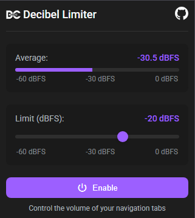

# 🔊 Decibel Limiter - Chrome Extension

## 📝 Description

Decibel Limiter is a Google Chrome extension that automatically controls and limits audio volume in browser tabs. This tool is ideal for protecting your hearing, preventing startling loud unexpected sounds, and maintaining a consistent audio level while browsing different websites.

## ✨ Key Features

- **🔄 Real-time Volume Limiting**: Automatically limits volume when it exceeds the set decibel threshold.
- **📊 Audio Level Monitoring**: Displays the current audio level in decibels (dBFS).
- **🎚️ Customizable Threshold**: Allows adjusting the limitation threshold between 0 and -60 dBFS.
- **🔖 Per-tab Activation/Deactivation**: Independent configuration for each browser tab.
- **📈 Intuitive Visual Interface**: Real-time visualization of audio level through a volume meter.
- **🌐 Compatibility with Popular Sites**: Works with most websites, including streaming platforms like Netflix.
- **🌙 Dark Mode Support**: Automatically adapts its appearance to the system theme.

## 🔍 How It Works

The extension uses JavaScript's Web Audio API to monitor and control the volume of media elements (`<audio>` and `<video>`) on web pages:

1. **Media Element Detection**: The extension automatically identifies all audio and video elements on the page, including those within Shadow DOM (such as on Netflix).

2. **Audio Analysis**: Using an audio analyzer (AnalyserNode), the extension constantly measures the volume level in decibels (dBFS).

3. **Dynamic Limiting**: When the audio level exceeds the set threshold, the extension automatically reduces the gain to keep the volume below the limit.

4. **Gradual Restoration**: Once the audio level returns below the threshold, the gain is gradually restored to maintain a natural listening experience.

5. **Configuration Persistence**: Preferences are saved per tab, allowing different configurations for different websites.

## 🎯 Use Cases

- **👂 Hearing Protection**: Prevents hearing damage caused by sudden loud sounds.
- **🌃 Night Browsing Experience**: Ideal for using the browser at night without disturbing others.
- **📊 Volume Normalization**: Maintains a consistent audio level across different websites.
- **🏢 Shared Work Environments**: Prevents disruptions from loud sounds in offices or shared spaces.
- **👨‍👩‍👧‍👦 Parental Control**: Limits maximum volume to protect children's hearing.

## ⚙️ Technical Considerations

- The extension uses the Web Audio API, which is compatible with most modern browsers.
- Audio analysis and limitation are performed entirely on the client side, without sending data to external servers.
- The extension implements special techniques to work with sites that use Shadow DOM, such as Netflix.
- A DOM mutation observation system is used to detect new media elements that are added dynamically.
- The extension is optimized to minimize impact on browser performance.

## 📋 Requirements

- Google Chrome version 88 or higher
- Permissions for active tabs and local storage access

## 📥 Installation

1. Download the source code or packaged extension
2. In Chrome, navigate to `chrome://extensions/`
3. Enable "Developer mode"
4. Click "Load unpacked" and select the extension folder

## 🚀 Usage

1. Click on the extension icon in the Chrome toolbar
2. Use the slider to adjust the limitation threshold (in dBFS)
3. Click the "Enable" button to activate the limitation
4. The volume meter will show the current audio level in real-time

## ❓ Troubleshooting

- **Extension doesn't detect audio**: Make sure the page is actively playing audio.
- **Limitation doesn't work on some sites**: Some websites use advanced techniques to play audio. The extension includes special support for popular sites like Netflix, but it might not work in all cases.
- **Audio cuts out or distorts**: Adjust the limitation threshold to a less restrictive value (closer to 0 dBFS).

## 🔒 Privacy and Security

- The extension does not collect or transmit user data
- All audio processing is done locally in the browser
- Internet access is not required for operation
- Source code is available for review

## 👥 Contributions

Contributions are welcome. If you want to improve this extension:

1. Fork the repository
2. Create a branch for your feature (`git checkout -b new-feature`)
3. Make your changes and commit (`git commit -am 'Add new feature'`)
4. Push the changes (`git push origin new-feature`)
5. Create a Pull Request

## 📄 License

This extension is distributed under the MIT license. See the LICENSE file for more details.

## 📞 Contact

If you have questions, suggestions, or problems, please create an issue in the GitHub repository or contact the developer directly.

---

Developed with ❤️ to improve your browsing experience.
